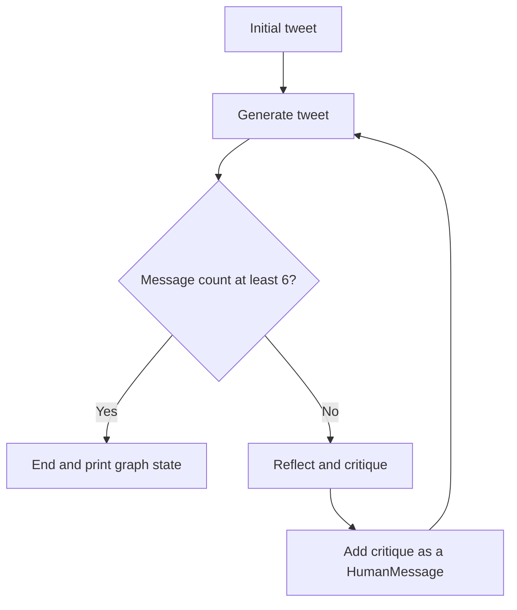

# LangGraph Reflection Agent

A small command-line demo that improves a draft tweet through repeated generation and critique. It uses LangGraph to alternate between a local Ollama model prompted to write a tweet and the same model prompted to critique it.

## About

`main.py` builds a two-node LangGraph workflow. The generation node writes or revises the tweet, and the reflection node gives feedback on length, style, and virality. Reflection feedback is added to the message history, then passed back to the generation prompt so the model can revise its previous draft.

The example uses a fixed tweet about LangChain tool calling. It is a terminal demo: there is no web interface, interactive input, or saved conversation state between runs.

## Workflow



1. `main.py` starts the graph with the original tweet as a `HumanMessage`.
2. `chains.py` provides a generation chain and a reflection chain. Both use the local `llama3.1:8b` model with different system prompts.
3. The generation node adds a draft or revised tweet to the message list.
4. Unless the message list has reached six messages, the reflection node critiques the latest draft. Its critique is added as a `HumanMessage` and fed back into the generation chain.
5. The graph ends when the message count reaches six. With the current initial input, that produces three generations and two reflections.
6. `main.py` prints the resulting graph state, including the conversation messages.

## Requirements and dependencies

- Python **3.13 or newer** (`.python-version` selects 3.13; `pyproject.toml` requires `>=3.13`).
- [uv](https://docs.astral.sh/uv/) to install dependencies from the project and lock files.
- [Ollama](https://ollama.com/) installed and running locally, with `llama3.1:8b` downloaded.

The runtime uses LangGraph, LangChain Core, `langchain-ollama`, and `python-dotenv`. `grandalf` is included for graph visualization. `pyproject.toml` also declares other LangChain integrations and utilities for other experiments in the repository; the current reflection demo does not use most of them.

## Setup

### 1. Install dependencies

From the repository root:

```bash
uv sync
```

`uv sync` uses `pyproject.toml` and `uv.lock`. Although LangGraph is imported directly by `main.py`, it is currently resolved transitively through the declared LangChain dependency.

### 2. Start Ollama and download the model

If the Ollama service is not already running, start it in a separate terminal:

```bash
ollama serve
```

Download the model used by both chains:

```bash
ollama pull llama3.1:8b
```

No cloud API key is required. `main.py` calls `load_dotenv()`, but the current code does not read any environment variables.

## Running

From the repository root, run:

```bash
uv run python main.py
```

The script prints a greeting, an ASCII and Mermaid representation of the graph, and the graph result. It also renders the graph to `flow.png` while the module is being initialized.

To try a different draft, edit the `HumanMessage` content in `main.py`. To adjust the writing or critique behavior, change the system prompts in `chains.py`.

## Project structure

```text
.                                           # Repository root for the LangGraph reflection demo
├── README.md                               # Overview, workflow, setup, and run instructions
├── .gitignore                              # Ignores local environments, secrets, and generated files
├── .python-version                         # Local Python version marker (3.13)
├── chains.py                               # Tweet generation and reflection prompt/model chains
├── flow.png                                # Mermaid image of the compiled graph; regenerated by main.py
├── main.py                                 # Graph state, generation/reflection nodes, loop, and example input
├── pyproject.toml                          # Project metadata and direct dependency declarations
├── requirements.txt                        # Pinned package list; missing a package imported by this project
└── uv.lock                                 # Exact resolved Python dependency versions
```

## Notes and gotchas

- **The tweet is hard-coded.** The script always processes the example in `main.py`; edit its `HumanMessage` to use a different draft.
- **The loop is bounded by message count.** `should_continue()` ends at six messages. Changing the initial state or adding more nodes can change how many generation and reflection passes occur.
- **The reflection is represented as a human turn.** `reflection_node()` wraps the critique text in a `HumanMessage` so the generation prompt treats it as feedback for revision.
- **The printed result is the full state.** `print(response)` displays the message history, rather than only the final tweet. The final generated message is `response["messages"][-1]`.
- **The graph image is written during module initialization.** Importing `main.py` also prints graph diagrams and generates or overwrites `flow.png`.
- **Use `uv sync` instead of relying on `requirements.txt`.** The pinned requirements file does not include `langchain-ollama`, which the project imports. `langgraph` is currently transitive rather than directly declared in `pyproject.toml`.
- **The model is local.** Ensure Ollama is running and has `llama3.1:8b` before launching the script.
