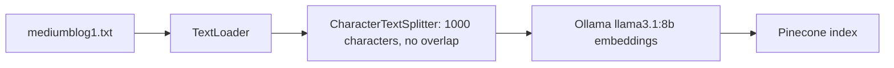
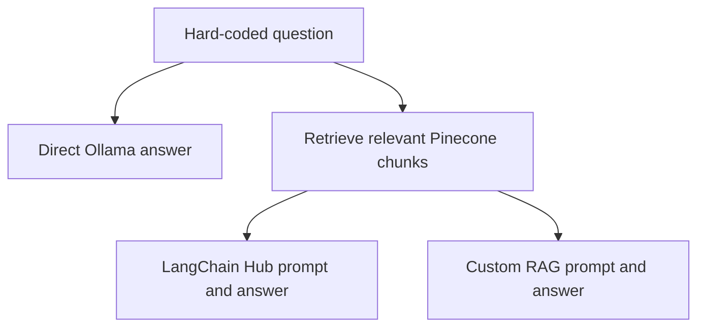

# Pinecone Vector Database RAG Demo

A command-line LangChain example for loading a text document into a Pinecone vector index and asking questions about it. The scripts demonstrate three answer paths: a direct Ollama response, a retrieval chain using a prompt from LangChain Hub, and a custom retrieval-augmented generation (RAG) chain.

## About

`mediumblog1.txt` is the sample source document: a copied article about vector databases. `ingestion.py` loads and chunks it, creates embeddings locally with Ollama, and writes the chunks to Pinecone. `main.py` compares an answer from the Ollama model alone with answers that retrieve relevant text from the Pinecone index.

## Workflow

### Ingest the source document



`ingestion.py` reads the text file from the current working directory, splits its contents with `CharacterTextSplitter(chunk_size=1000, chunk_overlap=0)`, and sends the resulting chunks and embeddings to the Pinecone index named by `PINECONE_INDEX_NAME`.

### Ask a question



When `main.py` runs, it asks “What is Pinecone in Machine Learning?” in three ways:

1. **Direct model call:** sends the question to `llama3.1:8b` without retrieved context.
2. **Hub-prompt RAG:** retrieves context from Pinecone and uses the public `langchain-ai/retrieval-qa-chat` prompt.
3. **Custom RAG:** retrieves context, asks the model not to guess when the context is insufficient, limits the answer to three sentences, and asks it to end with “thanks for asking!”.

## Requirements and dependencies

- Python **3.13 or newer** (`.python-version` selects 3.13; `pyproject.toml` requires `>=3.13`).
- [uv](https://docs.astral.sh/uv/) to install the locked Python dependencies.
- [Ollama](https://ollama.com/) installed and running locally, with `llama3.1:8b` downloaded. The code uses this model for both chat generation and embeddings.
- A Pinecone account, API key, and an existing index whose vector dimension matches the embeddings produced by the configured Ollama model.
- Network access to Pinecone and LangChain Hub. The second RAG example pulls its prompt from LangChain Hub when `main.py` runs.

The code uses LangChain, `langchain-community` for `TextLoader`, `langchain-text-splitters`, `langchain-classic` for retrieval chains and Hub prompts, `langchain-ollama`, `langchain-pinecone`, and `python-dotenv`. The project also declares other LangChain providers and development or demo packages that these two scripts do not use directly.

## Setup

### 1. Install Python dependencies

From the repository root:

```bash
uv sync
```

### 2. Start Ollama and download the model

If Ollama is not already running, start it in a separate terminal:

```bash
ollama serve
```

Download the model used by both scripts:

```bash
ollama pull llama3.1:8b
```

### 3. Configure Pinecone

Create a `.env` file in the repository root with your Pinecone API key and index name:

```dotenv
PINECONE_API_KEY=your_pinecone_api_key
PINECONE_INDEX_NAME=your_existing_index_name
```

Create the Pinecone index before running either script. Its vector dimension must match the output dimension of the configured Ollama embedding model. `.env` is ignored by Git; keep the real key local and out of commits.

## Running

Run ingestion first to populate the Pinecone index:

```bash
uv run python ingestion.py
```

Then run the three question-answering examples:

```bash
uv run python main.py
```

Run both commands from the repository root. `main.py` prints the direct model response, the Hub-prompt retrieval result, and the custom RAG result.

## Project structure

```text
.                                           # Repository root for the vector database demo
├── README.md                               # Project overview, workflows, setup, run steps, and notes
├── .gitignore                              # Excludes local environments, secrets, and generated files
├── .python-version                         # Local Python version marker (3.13)
├── ingestion.py                            # Loads, chunks, embeds, and indexes the sample text
├── main.py                                 # Runs direct, Hub-prompt RAG, and custom RAG examples
├── mediumblog1.txt                         # Sample article text about vector databases
├── pyproject.toml                          # Project metadata and direct dependency declarations
└── uv.lock                                 # Exact resolved Python dependency versions
```

## Notes and gotchas

- **Run from the repository root.** `ingestion.py` builds the source path from `os.getcwd()`, so running it from another directory can prevent it from finding `mediumblog1.txt`.
- **The Pinecone index is not created by these scripts.** Provision it first, set `PINECONE_INDEX_NAME`, and make sure its dimension matches the embedding model.
- **Re-ingestion does not clear the index or set stable IDs.** Running `ingestion.py` repeatedly may leave duplicate vectors in Pinecone.
- **The document is a copied web article.** It contains page-navigation text and image-caption fragments as well as article content, so retrieved chunks may include that noise.
- **The question is hard-coded.** Edit `query` near the top of the `__main__` block in `main.py` to test a different question.
- **Outputs differ by chain.** The second example prints the retrieval-chain result object; the third prints the model message object. Only the custom prompt includes the three-sentence and closing-phrase instructions.
- **The Hub-based chain needs network access.** It calls `hub.pull("langchain-ai/retrieval-qa-chat")` at runtime.
- **Extra dependencies are declared.** Packages for Google GenAI, OpenAI, Tavily, Streamlit, and other experiments are included in `pyproject.toml`, though these scripts do not directly use them.
