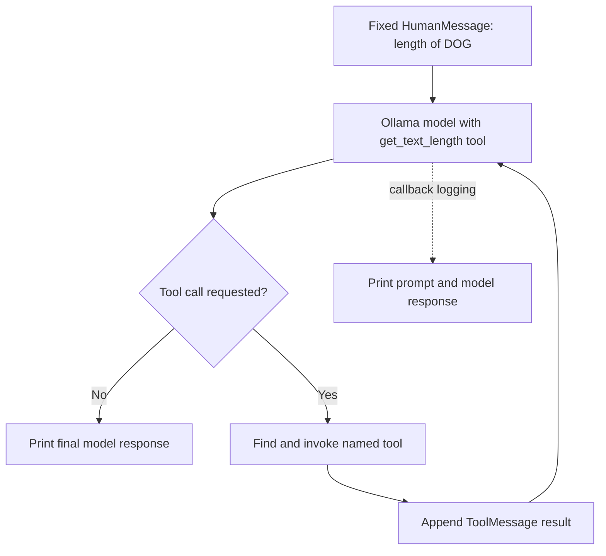

# LangChain Manual Tool-Calling Agent

A small command-line example of LangChain tool calling with a local Ollama chat model. The model receives a request to find the character length of “DOG.” If it requests the `get_text_length` tool, the Python program runs the tool, adds its result to the conversation, and asks the model to respond again.

## About

`main.py` defines one LangChain tool, binds it to `ChatOllama`, and implements the tool-call loop directly in Python. The example demonstrates how a model can request a function, how the application runs that function, and how its result is returned to the model.

The project also includes `AgentCallbackHandler` for logging model prompts and responses and Pydantic schemas for a possible answer-with-sources response. Those schemas are not used by the current script.

## Workflow



1. Load `.env` values with `python-dotenv` (the current code does not read any environment variables).
2. Define `get_text_length` and pass it to `ChatOllama.bind_tools()`.
3. Send a fixed `HumanMessage` to the `llama3.1:8b` model.
4. If the model returns tool calls, locate each tool by name, invoke it, and append its result as a `ToolMessage`.
5. Repeat the model call until it returns no tool calls, then print the final answer.

For the current prompt, `get_text_length` strips surrounding quote and newline characters, then returns the length of the remaining text. The expected length for `DOG` is 3.

## Requirements and dependencies

- Python **3.13 or newer** (`.python-version` selects 3.13 and `pyproject.toml` requires `>=3.13`).
- [uv](https://docs.astral.sh/uv/) to install the project dependencies from `pyproject.toml` and `uv.lock`.
- [Ollama](https://ollama.com/) installed and running locally, with the `llama3.1:8b` model downloaded.

The current runtime uses LangChain, `langchain-ollama`, LangChain Core messages and callbacks, and Pydantic. `pyproject.toml` also declares Google GenAI, OpenAI, and Tavily integrations plus Black and isort; the current example does not use those integrations or formatting tools at runtime.

## Setup

### 1. Install Python dependencies

From the repository root:

```bash
uv sync
```

### 2. Start Ollama and download the model

If Ollama is not already running, start it in a separate terminal:

```bash
ollama serve
```

Download the model used by the example:

```bash
ollama pull llama3.1:8b
```

No API key or `.env` configuration is currently required. `main.py` calls `load_dotenv()`, but it does not read environment variables.

## Running

From the repository root, run:

```bash
uv run python main.py
```

The script prints a startup message, callback output if the model triggers the configured hooks, tool observations when a tool is called, and the final model response. The sample question is hard-coded in `main.py`; edit the `HumanMessage` content to try another request.

## Project structure

```text
.                                           # Repository root for the manual tool-calling example
├── README.md                               # Project overview, workflow, setup, and run instructions
├── .gitignore                              # Ignores local environments, secrets, and generated files
├── .python-version                         # Local Python version marker (3.13)
├── main.py                                 # Tool definition, model setup, and manual tool-call loop
├── callbacks.py                            # Callback handler that prints model prompts and responses
├── schemas.py                              # Pydantic schemas for answers and source URLs
├── pyproject.toml                          # Project metadata and direct dependency declarations
└── uv.lock                                 # Exact resolved Python dependency versions
```

## Notes and gotchas

- **The prompt is fixed.** The script always asks for the length of `DOG`; edit the `HumanMessage` in `main.py` to change the request.
- **The tool loop has no iteration limit.** It continues until the model returns a message without tool calls. A model that repeatedly requests tools could keep the script running.
- **The tool return annotation does not match its value.** `get_text_length` is annotated as returning `str`, but it returns an integer. The caller converts the observation to a string before adding it to the message history.
- **The callback handler can print prompt contents.** If you change the example to pass private input, review or remove `AgentCallbackHandler` logging before running it.
- **The response schemas are not connected to the agent.** `schemas.py` defines `Source` and `AgentResponse`, but `main.py` does not import them or validate model output against them.
- **No cloud credentials are needed by the current example.** The model runs through the local Ollama service; `.env` is loaded but no variables are read.
- **`pyproject.toml` is the dependency source of truth.** The repository has no `requirements.txt`; use `uv sync` to recreate the locked environment.
