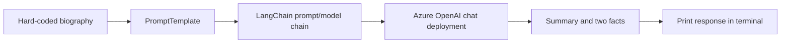

# LangChain Azure OpenAI Summary Demo

A small command-line LangChain example. It combines a hard-coded biography with a prompt template, sends the request to an Azure OpenAI chat deployment, and prints a short summary plus two interesting facts.

## About

The example in `main.py` uses `AzureChatOpenAI` from `langchain-openai`. A `PromptTemplate` inserts the embedded biography into instructions, and a LangChain runnable chain (`prompt | model`) sends the formatted prompt to Azure OpenAI. The script prints the returned message content to the terminal.

This is a basic prompt-and-response demo. It does not accept user input, load external documents, retain conversation history, or expose a web interface.

## Workflow



1. Load environment variables from `.env` with `python-dotenv`.
2. Define the biography and summary instructions in `main.py`.
3. Configure `AzureChatOpenAI` using Azure endpoint, key, deployment, API version, and model name values from the environment.
4. Invoke the chain once and print the model response.

## Requirements and dependencies

- Python **3.13 or newer**, as required by `pyproject.toml`.
- [uv](https://docs.astral.sh/uv/) to install dependencies from the project and lock files.
- An Azure OpenAI resource with a deployed chat model.
- Network access to the Azure OpenAI endpoint.
- Azure endpoint, API key, deployment name, API version, and model name configured in `.env`.

The runtime path in `main.py` uses `langchain-openai`, LangChain Core prompt templates, and `python-dotenv`. The project also declares `langchain`, `langchain-google-genai`, and `langchain-ollama`, which are not used by this example, along with Black and isort for formatting.

## Setup

### 1. Install dependencies

From the repository root:

```bash
uv sync
```

This installs the dependencies declared in `pyproject.toml` using the resolved versions in `uv.lock`.

### 2. Configure Azure OpenAI

Create or update a `.env` file in the repository root with values from your Azure OpenAI resource and deployment:

```dotenv
AZURE_OPENAI_ENDPOINT=https://your-resource.openai.azure.com/
AZURE_OPENAI_API_KEY=your_api_key
AZURE_OPENAI_DEPLOYMENT_NAME=your_deployment_name
AZURE_OPENAI_API_VERSION=your_api_version
AZURE_OPENAI_MODEL_NAME=your_model_name
```

The `.env` file is excluded by `.gitignore`; keep real credentials out of source control. All five variables are read in `main.py` when the Azure chat model is initialized.

## Running

Run the script from the project root:

```bash
uv run python main.py
```

On success, the terminal prints `LangChain Hello World!` followed by the Azure model's response. If Azure configuration is missing or invalid, model initialization or the request will fail.

## Project structure

```text
.
├── README.md                 # Project overview, workflow, setup, and run instructions
├── .gitignore                # Ignores local secrets, environments, and generated files
├── .python-version           # Local Python version marker (3.13)
├── main.py                   # Hard-coded biography prompt and Azure OpenAI request
├── pyproject.toml            # Project metadata and declared Python dependencies
└── uv.lock                   # Exact resolved Python dependency versions
```

## Notes and gotchas

- **The biography is hard-coded.** To summarize a different person or text, edit `information` in `main.py`; the script does not prompt for input.
- **Some biography details can become stale.** The text includes time-sensitive claims and a net-worth estimate dated October 2025; review it before reusing the example.
- **Azure values must match each other.** `AZURE_OPENAI_DEPLOYMENT_NAME` identifies the deployment, while `AZURE_OPENAI_MODEL_NAME` is passed separately to LangChain. Use values appropriate for the Azure resource and API version you have configured.
- **Only Azure OpenAI is used at runtime.** Google GenAI and Ollama packages are declared in `pyproject.toml` but are not used by the current script. `AzureOpenAI` is also imported in `main.py` but unused; requests are made through `AzureChatOpenAI`.
- **No API credentials are checked into this project.** Keep the `.env` file local and do not paste keys into source files or commits.
