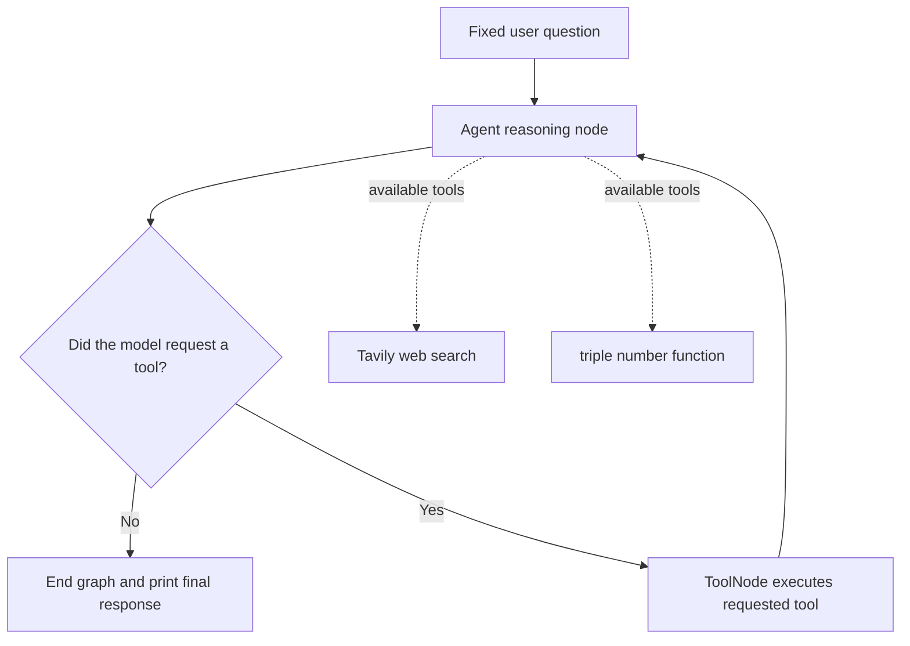

# ReAct Agent with LangGraph and Function Calling

A command-line agent demo that uses a local Ollama model and LangGraph to decide when to call tools. The available tools are Tavily web search and a small `triple` function that multiplies a number by three. The example asks for the temperature in Tokyo, then asks the agent to triple it.

## About

The main graph is assembled in `main.py` from the reasoning node and tool executor in `nodes.py`. `react.py` configures the `llama3.1:8b` chat model and binds the available tools to it. The graph runs until the model responds without requesting another tool.

This is a terminal demo with a fixed question. It does not provide a web interface, accept interactive input, or maintain a conversation across runs.

## Workflow



1. `main.py` creates a `MessagesState` graph and sets the reasoning node as its entry point.
2. `nodes.py` sends the conversation and a system message to the Ollama model.
3. `should_continue()` checks the latest assistant message. If it contains tool calls, the graph runs `ToolNode`; otherwise the graph ends.
4. Tool results are sent back to the model, which can request another tool or produce the final answer.
5. The script prints the last assistant message.

The initial prompt in `main.py` asks: “What is the temperature in Tokyo? List it and then triple it”. The model can use Tavily for the lookup and `triple` for the arithmetic.

## Requirements and dependencies

- Python **3.13 or newer** (`.python-version` selects 3.13 and `pyproject.toml` requires `>=3.13`).
- [uv](https://docs.astral.sh/uv/) to install the Python dependencies.
- [Ollama](https://ollama.com/) installed and running locally, with `llama3.1:8b` downloaded.
- A Tavily API key for the web-search tool.
- Access to the Tavily API and a running local Ollama service.

The runtime uses LangGraph, `langchain-ollama`, `langchain-tavily`, `langchain-experimental`, and `python-dotenv`. `pyproject.toml` declares the project dependencies and `uv.lock` pins their resolved versions. Other declared packages support separate LangChain integrations or development tools and are not used directly in this demo.

## Setup

### 1. Install dependencies

From the repository root:

```bash
uv sync
```

### 2. Start Ollama and download the model

If Ollama is not already running, start it in a separate terminal:

```bash
ollama serve
```

Download the model used by the agent:

```bash
ollama pull llama3.1:8b
```

### 3. Configure Tavily

Create a `.env` file in the repository root with your Tavily API key:

```dotenv
TAVILY_API_KEY=your_tavily_api_key
```

The repository `.gitignore` excludes `.env`; keep real keys out of source control. The local Ollama model does not require a cloud model API key.

## Running

Run the graph from the project root:

```bash
uv run python main.py
```

The terminal prints a greeting and then the model's final response. `main.py` also generates or overwrites `flow.png` from the compiled graph when the module is imported or run.

To change the task, edit the `HumanMessage` content passed to `app.invoke()` in `main.py`. To add or change tools, update the tool list in `react.py` and ensure the tool executor in `nodes.py` uses that list.

## Project structure

```text
.                                           # Repository root for the LangGraph ReAct agent
├── README.md                               # Overview, workflow, setup, and run instructions
├── .gitignore                              # Ignores virtual environments, secrets, and generated files
├── .python-version                         # Local Python version marker (3.13)
├── flow.png                                # Mermaid rendering of the compiled LangGraph workflow
├── main.py                                 # Builds, visualizes, and invokes the LangGraph agent
├── nodes.py                                # Agent reasoning node and LangGraph tool executor
├── react.py                                # Ollama model and Tavily/triple tool configuration
├── pyproject.toml                          # Project metadata and direct dependency declarations
├── requirements.txt                        # Pinned environment export; incomplete for current imports
├── uv.lock                                 # Exact resolved Python dependency versions
└── mcpdoc/                                 # Local generated bytecode cache; not application source
    └── __pycache__/                        # Python cache files present in the workspace
        ├── __init__.cpython-313.pyc        # Cached package initialization bytecode
        ├── _version.cpython-313.pyc        # Cached version module bytecode
        ├── cli.cpython-313.pyc             # Cached CLI module bytecode
        ├── langgraph.cpython-313.pyc       # Cached LangGraph module bytecode
        ├── main.cpython-313.pyc            # Cached main module bytecode
        └── splash.cpython-313.pyc          # Cached splash module bytecode
```

## Notes and gotchas

- **Use `uv sync` to install the current dependencies.** `requirements.txt` does not include every package imported by the current code, including `langchain-ollama` and `langchain-experimental`.
- **The prompt is hard-coded.** `main.py` always asks the Tokyo temperature question; edit the message to try a different task.
- **Tavily is required when its tool is used.** Without a valid `TAVILY_API_KEY`, web search cannot run. The agent's question asks for current weather, so a working search tool is needed for a useful result.
- **Ollama must be available locally.** Make sure its service is running and `llama3.1:8b` is installed before starting the script.
- **The graph image is generated during import.** Importing `main.py` compiles the graph and writes `flow.png`, so importing the module also has a filesystem side effect.
- **Some imports are unused.** `react.py` imports `create_agent`, `HumanMessage`, and `PythonREPLTool`, but the current graph uses only `ChatOllama`, `TavilySearch`, and the `triple` tool.
- **The `mcpdoc/__pycache__` files are generated artifacts.** They are not needed to run this project and normally should not be committed.
