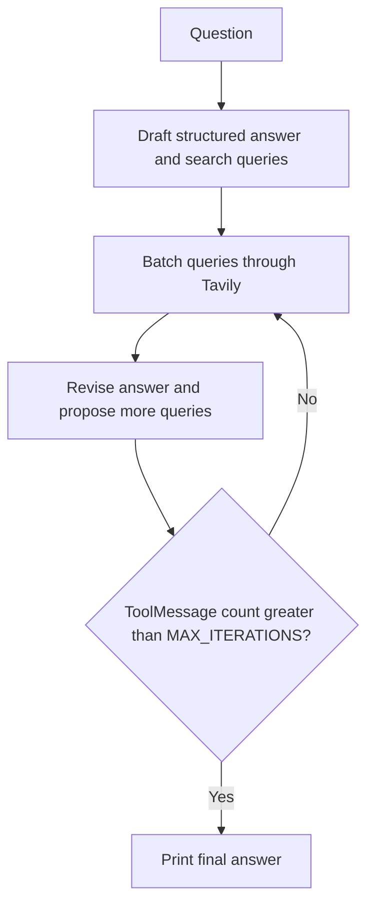

# LangGraph Reflexion Research Agent

A self-reflective research agent built with LangChain and LangGraph. Given a question, it drafts an answer, critiques itself, searches the web with Tavily, and produces revised answers using the search results. The current example asks about the AI-powered/autonomous SOC problem domain and startups in that space that have raised capital. It uses a local Ollama model (`qwen3.5:9b`) and structured Pydantic output; Tavily is the only cloud service configured in the current workflow.

## How it works

1. **Draft** — the model produces an answer, a critique with recommendations, and search queries using the `AnswerQuestion` schema.
2. **Search** — `executor.py` batches the proposed queries through Tavily. Each query can return up to five results.
3. **Revise** — the model consumes the earlier messages and search results, then returns a revised answer, another critique and query list, and references using `ReviseAnswer`.
4. The graph repeats the search-and-revise path until its `ToolMessage` counter exceeds `MAX_ITERATIONS`, then prints the final answer text in a bordered box.

The prompts are defined in `chains.py`. They include the current local time, ask for an initial answer of about 250 words, and instruct revisions to stay under 250 words and include references. The number of results and returned references still depends on model output and Tavily results.



## Requirements

- Python 3.13+
- [uv](https://docs.astral.sh/uv/) (recommended)
- [Ollama](https://ollama.com/) running locally with a pulled model (default: `qwen3.5:9b`)
- A [Tavily](https://tavily.com/) API key
- Network access to the Tavily API; Ollama must be reachable on the local machine

## Setup

### 1. Install dependencies

Run this from the directory containing `pyproject.toml` and `main.py`:

```bash
uv sync
```

`requirements.txt` is a pinned environment export and does not include `langchain-ollama`, which the current code imports. Do not rely on it for a clean install unless it is regenerated from `pyproject.toml`.

### 2. Set up Ollama

Install [Ollama](https://ollama.com/download), then pull the model used in `chains.py`:

If Ollama does not start automatically after installation, start it in a separate terminal first:

```bash
ollama serve
```

```bash
ollama pull qwen3.5:9b
```

### 3. Configure environment variables

Create a `.env` file in the project root:

```bash
TAVILY_API_KEY=your_tavily_api_key_here
```

You can get a Tavily API key from [tavily.com](https://tavily.com/). `.env` is ignored by Git; keep the real key in this local file and out of source control.

## Usage

Run the agent with:

```bash
uv run python main.py
```

If you installed dependencies into an already active virtual environment, run `python main.py` instead.

This will:

- Print an ASCII and Mermaid diagram of the graph to the terminal
- Save a visual diagram of the workflow to `flow.png`
- Run the agent on the example question hardcoded in `main.py`
- Print the final revised answer in a terminal box

`main.py` invokes the graph at module level, so running or importing it also makes model and Tavily requests. It is currently a one-shot script, not an interactive REPL.

### Changing the question

Edit the `content` value in the `graph.invoke(...)` call near the bottom of `main.py`:

```python
response = graph.invoke(
    {
        "messages": [
            {
                "role": "user",
                "content": "Your question here",
            }
        ]
    }
)
```

### Adjusting the search/revision limit

Change `MAX_ITERATIONS` near the top of `main.py` (default is `2`). The current counter counts `ToolMessage` results and stops only when the count is greater than this value. Since the initial draft also triggers a search, a value of `2` permits three search batches/revision outputs when each search produces a result.

## Project structure

```text
.                                           # Repository root for the self-reflective research agent
├── README.md                 # Project overview, workflow, setup, and run instructions
├── .gitignore                # Excludes local secrets, virtual environments, and generated files
├── .python-version           # Local Python version marker (3.13)
├── chains.py                 # Ollama model and structured draft/revision prompt chains
├── executor.py               # Batches proposed queries through Tavily and returns ToolMessages
├── flow.png                  # Generated diagram of the compiled LangGraph workflow
├── main.py                   # Graph nodes, iteration logic, fixed example question, and execution
├── pyproject.toml             # Project metadata and direct dependency declarations
├── requirements.txt           # Pinned environment export; incomplete for current code
├── schemas.py                # Pydantic answer, reflection, query, and reference schemas
├── utils.py                  # Terminal box formatting and elapsed-time formatting helpers
└── uv.lock                   # Exact resolved Python dependency versions
```

## Notes

- `executor.py` runs all queries from one structured response in a Tavily batch, with `max_results=5` per query. The graph counts the returned `ToolMessage` batches, not the individual search results or individual queries.
- If the model returns no search queries, `execute_tools()` returns no `ToolMessage`, so the counter does not advance. The graph may continue until LangGraph's recursion limit in that case.
- The final display prints `last_message.content`; it does not separately render the structured `references` field from `ReviseAnswer`.
- `main.py` builds, prints, renders, and invokes the graph at module level without a `__main__` guard. Importing `main` therefore also triggers graph rendering and the research run.
- `utils.format_time()` is available but is not currently used by the main workflow.
- Swap `ChatOllama` in `chains.py` for another provider (e.g. `langchain-openai` or `langchain-google-genai`) only if that model/provider supports the structured output used by the chains.
