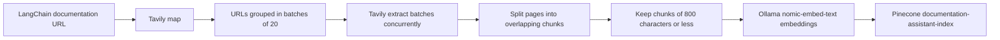
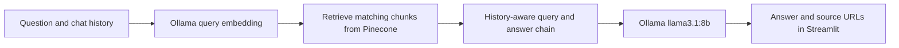

# LangChain Documentation Assistant

A Streamlit chat app that answers questions about LangChain documentation with retrieval-augmented generation (RAG). It retrieves relevant documentation chunks from Pinecone, sends them with the question to a local Ollama model, and displays the answer with source URLs.

The repository also contains an ingestion script that crawls the LangChain documentation site with Tavily, extracts and chunks its pages, creates local Ollama embeddings, and writes the vectors to Pinecone. Run ingestion before chatting against a new or empty index.

## About

| Part | What it does |
| --- | --- |
| Chat UI | Accepts questions and renders the conversation in Streamlit. |
| Retriever and answer chain | Uses Ollama embeddings to search Pinecone, then asks Ollama's `llama3.1:8b` model to answer with retrieved context. It uses LangChain Hub prompts and passes prior turns to a history-aware retriever. |
| Ingestion pipeline | Maps the LangChain docs site with Tavily, extracts pages, splits text, embeds the chunks, and indexes them in Pinecone. |

## Workflow

### Documentation ingestion



`ingestion.py` starts from `https://docs.langchain.com/oss/python/langchain/overview`. Tavily mapping is configured for depth 5, breadth 20, and up to 1,000 pages. Extracted page content is split with a 4,000-character target and 200-character overlap; the current code then filters out every chunk longer than 800 characters. It indexes the remaining chunks in batches of 100, sequentially, with a short pause between batches.

### Chat request



The chat application builds the retriever and model chain in `backend/core.py`. Conversation turns are held in Streamlit session state, so chat history lasts for the current session and is not stored as a separate database.

## Requirements and dependencies

- Python **3.13 or newer** (`.python-version` selects 3.13; `pyproject.toml` requires `>=3.13`).
- [uv](https://docs.astral.sh/uv/) to install the locked Python dependencies.
- [Ollama](https://ollama.com/) installed and running locally, with the models `llama3.1:8b` and `nomic-embed-text` downloaded.
- A Pinecone account and an index named `documentation-assistant-index`.
- A Tavily API key to run documentation ingestion.
- Network access for Tavily, Pinecone, LangChain Hub prompt retrieval, and the profile image fetched by the UI from Gravatar.

The main Python libraries declared in `pyproject.toml` include Streamlit, LangChain, `langchain-community`, `langchain-ollama`, `langchain-pinecone`, `langchain-tavily`, and `python-dotenv`. The code also imports `langchain-classic`, which is currently brought in transitively through `langchain-community`. The project declares other provider and utility packages, including FAISS, Google GenAI, OpenAI, PyPDF, Black, and isort.

## Setup

### 1. Install Python dependencies

From the repository root:

```bash
uv sync
```

This creates or updates the project environment from `pyproject.toml` and `uv.lock`.

### 2. Download the Ollama models

Make sure the Ollama service is running. If your installation does not start it automatically, start it in a separate terminal:

```bash
ollama serve
```

Download both models used by the application:

```bash
ollama pull llama3.1:8b
ollama pull nomic-embed-text
```

### 3. Configure service credentials

Create a `.env` file in the repository root (it is ignored by Git) and add your keys:

```dotenv
PINECONE_API_KEY=your_pinecone_api_key
TAVILY_API_KEY=your_tavily_api_key
```

Pinecone must already contain an index named `documentation-assistant-index`, matching the embedding dimensions produced by `nomic-embed-text`. The chat reads the index name from `backend/consts.py`; `ingestion.py` repeats the same name directly. Tavily is needed for ingestion; Pinecone is needed for both ingestion and chat.

## Running

### Ingest documentation

Run this to populate the Pinecone index. It can be run again to ingest the current documentation:

```bash
uv run python ingestion.py
```

The crawl can process up to 1,000 mapped URLs and uses your Tavily and Pinecone accounts. Allow it time to complete; progress and failures are printed in the terminal.

### Start the chat app

In another terminal, from the repository root:

```bash
uv run streamlit run main.py
```

Streamlit prints a local URL (usually `http://localhost:8501`) to open in your browser. The app expects the Pinecone index to exist and contain indexed documents. Enter a question in the prompt field; the current UI invokes the model when the prompt is non-empty, while the Submit button is not the only trigger.

## Project structure

```text
.                                               # Root of the LangChain documentation assistant project
├── README.md                                   # Project overview, setup, workflow, and run instructions
├── .gitignore                                  # Generated files, local environments, and secrets excluded from Git
├── .python-version                             # Requested local Python version (3.13)
├── .streamlit/                                 # Streamlit-specific configuration
│   └── config.toml                             # Streamlit theme and appearance settings
├── .idea/                                      # IDE project configuration
│   ├── .gitignore                              # IDE-specific ignore rules
│   ├── documentation-helper.iml                # IntelliJ project module descriptor
│   ├── misc.xml                                # IntelliJ project settings
│   ├── modules.xml                             # IntelliJ module registry
│   ├── vcs.xml                                 # IDE version-control mapping
│   └── inspectionProfiles/                     # IntelliJ code inspection profiles
│       ├── Project_Default.xml                 # Project inspection profile
│       └── profiles_settings.xml               # IDE inspection profile settings
├── backend/                                    # Retrieval and LLM backend implementation
│   ├── __init__.py                             # Marks backend as a Python package
│   ├── consts.py                               # Shared Pinecone index name
│   └── core.py                                 # Ollama, Pinecone retrieval, prompts, and RAG chain
├── ingestion.py                                # Tavily crawl, extraction, chunking, and Pinecone indexing
├── logger.py                                   # Colored terminal logging helpers for ingestion
├── main.py                                     # Streamlit chat interface and session history
├── mcpdoc/                                     # Local directory containing generated mcpdoc bytecode only
│   └── __pycache__/                            # Generated Python bytecode cache shown in the local tree
│       ├── __init__.cpython-313.pyc            # Cached bytecode for mcpdoc package initialization
│       ├── _version.cpython-313.pyc            # Cached bytecode for mcpdoc version metadata
│       ├── cli.cpython-313.pyc                 # Cached bytecode for mcpdoc command-line module
│       ├── langgraph.cpython-313.pyc           # Cached bytecode for mcpdoc LangGraph integration
│       ├── main.cpython-313.pyc                # Cached bytecode for mcpdoc main module
│       └── splash.cpython-313.pyc              # Cached bytecode for mcpdoc splash module
├── pyproject.toml                              # Project metadata and direct dependency declarations
├── requirements.txt                            # Pinned package list; currently incomplete for this app
├── static/                                     # Static assets used by the Streamlit interface
│   ├── css/                                    # Custom stylesheet assets
│   │   └── styles.css                          # Custom styles loaded by the Streamlit UI
│   └── images/                                 # Logos and banner images
│       ├── LangChain Logo.png                  # LangChain logo asset
│       ├── Tavily Logo Trimmed Padded.png      # Padded Tavily logo asset
│       ├── Tavily Logo.png                     # Tavily logo asset
│       ├── Trimmed Padded Langchain.png        # Padded LangChain logo asset
│       └── banner.gif                          # Animated banner asset
└── uv.lock                                     # Exact resolved Python dependency versions
```

## Notes and gotchas

- **Use `uv sync` for installation.** `requirements.txt` does not currently list all packages imported by the application, including `langchain-ollama`, `langchain-pinecone`, and `langchain-classic`. Regenerate it from the project dependencies before relying on it for a pip-only install.
- **Index and model names are fixed in code.** The Pinecone index is `documentation-assistant-index`; the chat and ingestion models are `llama3.1:8b` and `nomic-embed-text`.
- **The ingestion size filter is tighter than the splitter setting.** Although splitting targets 4,000 characters, chunks over 800 characters are discarded before indexing. This can exclude a substantial amount of extracted text.
- **Ingestion failure handling needs attention.** An extraction exception is logged by its batch task, which returns no result; the aggregation step then expects a result dictionary and can stop with an error. Indexing batch errors are logged, but the pipeline can still print its final success message after a partial index. Check the terminal output rather than relying on that final message alone.
- **Re-ingestion does not remove stale vectors.** Deterministic IDs allow identical source/content chunks to be upserted, but changed or removed chunks are not deleted from Pinecone. Old content can remain searchable after a crawl.
- **The profile image depends on Gravatar availability.** `main.py` fetches a Gravatar image for a hard-coded email address when the page loads; a network or request error can prevent the UI from rendering.
- **Prompt submission behavior follows the current Streamlit code.** Any non-empty prompt value triggers `run_llm`; the Submit button does not gate that call, and Streamlit reruns can submit the same still-filled prompt again.
- **Generated bytecode is not source code.** The `mcpdoc/__pycache__` entries shown above are local Python cache files and are normally omitted from a maintained source tree.
