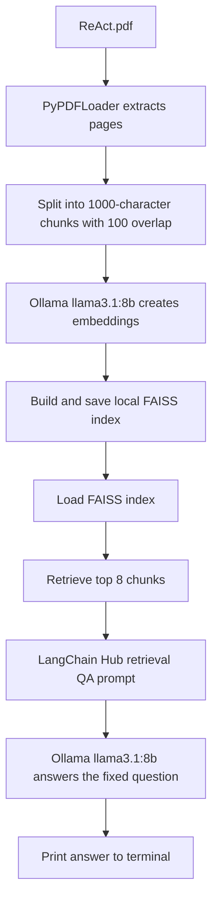

# Chat with PDF: ReAct Demo

A small command-line retrieval-augmented generation (RAG) demo. It reads `ReAct.pdf`, splits the extracted text into chunks, creates embeddings with a local Ollama model, stores the vectors in FAISS, and asks an Ollama chat model to answer a question using the retrieved PDF context.

The current script is a single-question example rather than an interactive chat interface: it asks for a three-sentence gist of ReAct and prints the answer in the terminal.

## About

| Component | Purpose |
| --- | --- |
| `ReAct.pdf` | Source document loaded by the PDF loader. |
| LangChain PDF loader and splitter | Extracts PDF pages and splits them into 1,000-character chunks with 100-character overlap. |
| Ollama | Creates embeddings and generates the answer locally using `llama3.1:8b`. |
| FAISS | Stores and searches document vectors locally in `FAISS_INDEX_REACT/`. |
| Retrieval QA chain | Retrieves up to eight relevant chunks, combines them with a prompt from LangChain Hub, and passes the context and question to the chat model. |

## Workflow



When `main.py` runs, it builds the FAISS index from the PDF and saves it to `FAISS_INDEX_REACT/`. It then loads that index, constructs a retrieval chain, asks “Give me the gist of ReAct in 3 sentences.”, and prints the generated answer.

## Requirements and dependencies

- Python **3.13 or newer** (`.python-version` selects 3.13 and `pyproject.toml` requires `>=3.13`).
- [uv](https://docs.astral.sh/uv/) to install the locked Python dependencies.
- [Ollama](https://ollama.com/) installed and running locally, with `llama3.1:8b` downloaded.
- Network access when running the script so LangChain can fetch the public retrieval QA prompt from LangChain Hub.

The code uses LangChain, `langchain-community` (PDF loading and FAISS integration), `langchain-ollama`, `langchain-classic`, `langchain-text-splitters`, `pypdf`, `faiss-cpu`, and `python-dotenv`. `pyproject.toml` also declares Google GenAI, OpenAI, Pinecone, Tavily, Black, and isort; the current `main.py` does not use those integrations or formatting tools at runtime.

## Setup

### 1. Install the Python dependencies

From the repository root:

```bash
uv sync
```

This installs the project dependencies using `pyproject.toml` and `uv.lock`.

### 2. Start Ollama and download the model

Make sure Ollama is running. If it does not start automatically on your system, start it in a separate terminal:

```bash
ollama serve
```

Download the model used for both embeddings and answer generation:

```bash
ollama pull llama3.1:8b
```

No API keys or `.env` values are currently required by `main.py`. It calls `load_dotenv()`, but does not read any environment variables.

## Running

Run the script from the repository root so the relative PDF and FAISS paths resolve correctly:

```bash
uv run python main.py
```

The script reads `ReAct.pdf`, rebuilds the FAISS index, retrieves context for its hard-coded question, and prints the answer. It does not launch a web app or accept a question from the command line. To ask a different question, edit the `input` value passed to `retrieval_chain.invoke()` in `main.py`.

## Project structure

```text
.
├── README.md                              # Project overview, workflow, setup, and run instructions
├── .gitignore                             # Excludes local environments, generated files, and secrets
├── .python-version                        # Requested local Python version (3.13)
├── main.py                                # PDF ingestion, local indexing, retrieval, and fixed-question demo
├── ReAct.pdf                              # Source PDF loaded by the script
├── FAISS_INDEX_REACT/                     # Local FAISS vector index generated from the PDF
│   ├── index.faiss                        # FAISS vector index data
│   └── index.pkl                          # Pickled document and index metadata
├── pyproject.toml                         # Project metadata and direct Python dependencies
└── uv.lock                                # Exact resolved Python dependency versions
```

## Notes and gotchas

- **Run from the repository root.** The PDF path is built from the current working directory, and the FAISS index uses a relative folder path.
- **The index is rebuilt on every run.** `main.py` creates a new FAISS index from `ReAct.pdf` and writes it to `FAISS_INDEX_REACT/` before loading it. The checked-in index files are overwritten when the script runs.
- **Only one question is asked.** The question is hard-coded in `main.py`; there is no interactive prompt, chat history, or Streamlit interface in this branch.
- **The Hub prompt needs network access.** The script calls `hub.pull()` to fetch `langchain-ai/retrieval-qa-chat` when it runs.
- **The model is used for embeddings too.** `llama3.1:8b` is configured for both vector embeddings and chat generation. The same model must be available through the local Ollama service.
- **FAISS metadata uses pickle deserialization.** `FAISS.load_local()` is called with `allow_dangerous_deserialization=True`. Only load index files you trust; an untrusted `index.pkl` can execute malicious code when deserialized.
- **`.env` is not currently needed.** The script loads it for convenience, but no environment variables are referenced in the current code.
